# PR #396 - AI Findings Document Upload Flow Architecture

## Overview

This PR handles **three scenarios** for AI Findings generation:
1. **Initial Upload** - First document(s) uploaded to RFX
2. **Additional Upload** - Adding new documents to existing RFX
3. **Revision Upload** - Replacing an existing document with a new version

The key innovation is the **"Pre-merge References Before Description"** approach - merging old + new references BEFORE LLM generates description.

---

## Complete Flow Chart (Mermaid)

```mermaid
flowchart TD
    %% ==================== TRIGGER ====================
    A["🔄 User uploads document to RFX"] --> B["📦 AiFindingsOrchestration initialized"]
    
    %% ==================== STEP 1: DETERMINE UPLOAD TYPE ====================
    B --> C{"doc_ids<br/>provided?"}
    C -->|"No"| INIT["🟢 INITIAL UPLOAD<br/>extra_doc = FALSE"]
    C -->|"Yes"| D{"original_document_id<br/>exists?"}
    D -->|"No"| EXTRA["🔵 ADDITIONAL UPLOAD<br/>extra_doc = TRUE"]
    D -->|"Yes"| REV["🟠 REVISION UPLOAD<br/>extra_doc = TRUE"]
    
    %% ==================== SHARED STEPS 2-4 ====================
    INIT --> SHARED
    EXTRA --> SHARED
    REV --> SHARED
    
    subgraph SHARED["📋 STEPS 2-4: Common Processing"]
        S2["Step 2: Fetch requirements from DB"]
        S2 --> S3["Step 3: Get embeddings from Milvus<br/>(only from NEW doc_ids)"]
        S3 --> S4["Step 4: Merge back-to-back chunks"]
    end
    
    %% ==================== DIVERGENCE ====================
    SHARED --> CHECK{"extra_doc?"}
    
    %% ==================== 🟢 INITIAL UPLOAD PATH ====================
    CHECK -->|"FALSE"| INIT_PATH
    subgraph INIT_PATH["🟢 INITIAL UPLOAD PATH"]
        I1["Skip Step 4.5"]
        I1 --> I2["🤖 Step 5: LLM generates description"]
        I2 --> I3["Skip Step 6"]
        I3 --> I4["💾 Step 7: Save findings"]
    end
    
    %% ==================== 🔵 ADDITIONAL UPLOAD PATH ====================
    CHECK -->|"TRUE + no revision"| ADD_PATH
    subgraph ADD_PATH["🔵 ADDITIONAL UPLOAD PATH"]
        A1["⭐ Step 4.5: merge_references_before_description"]
        A1 --> A2["Get existing findings for RFX"]
        A2 --> A3{"Existing finding<br/>for requirement?"}
        A3 -->|"No"| A4["Keep new refs only"]
        A3 -->|"Yes"| A5["Fetch OLD refs from DB<br/>(Doc1 + Doc3 refs)"]
        A5 --> A6["Add old refs to DataFrame"]
        A6 --> A7["Mark old finding for deletion"]
        A4 --> A8["Combined DataFrame:<br/>Doc1 refs + Doc3 refs + NEW refs"]
        A7 --> A8
        A8 --> A9["🤖 Step 5: LLM sees ALL refs<br/>Generates merged description"]
        A9 --> A10["🗑️ Step 6: Delete old finding"]
        A10 --> A11["💾 Step 7: Save merged finding"]
    end
    
    %% ==================== 🟠 REVISION UPLOAD PATH ====================
    CHECK -->|"TRUE + has revision"| REV_PATH
    subgraph REV_PATH["🟠 REVISION UPLOAD PATH (Doc1→Doc4)"]
        R1["⭐ Step 4.5: merge_references_before_description"]
        R1 --> R2["Get existing findings for RFX"]
        R2 --> R3["Fetch OLD refs from DB"]
        R3 --> R4{"Is ref from<br/>original_document_id?<br/>(Doc1)"}
        R4 -->|"Yes (Doc1)"| R5["❌ EXCLUDE - being replaced"]
        R4 -->|"No (Doc3)"| R6["✅ KEEP - not being revised"]
        R5 --> R7["Combined DataFrame:<br/>Doc3 refs (kept) + Doc4 refs (new)"]
        R6 --> R7
        R7 --> R8["🤖 Step 5: LLM sees Doc3 + Doc4 refs<br/>(Doc1 refs excluded)"]
        R8 --> R9["🗑️ Step 6: Delete old finding"]
        R9 --> R10["💾 Step 7: Save finding with<br/>Doc3 + Doc4 references"]
    end
    
    %% ==================== RESULT ====================
    INIT_PATH --> RESULT
    ADD_PATH --> RESULT
    REV_PATH --> RESULT
    
    subgraph RESULT["✅ RESULT"]
        RES["Finding saved to database"]
    end
    
    %% ==================== STYLING ====================
    style INIT fill:#5cb85c,color:#fff
    style EXTRA fill:#4a90d9,color:#fff
    style REV fill:#f0ad4e,color:#000
    style R5 fill:#d9534f,color:#fff
    style R6 fill:#5cb85c,color:#fff
```



---

## Key Components Changed

### 1. `app/ai/service.py` - Main Orchestration Flow

```
Step 1: Initialize orchestration (sets extra_doc flag)
Step 2: Get requirements from DB
Step 3: Get embeddings from Milvus (text + vision)
Step 4: Merge back-to-back findings
Step 4.5: ⭐ NEW - Pre-merge references (if extra_doc)
Step 5: Create AI name and description (LLM)
Step 6: ⭐ CHANGED - Delete NOT_MATCH findings (if extra_doc)
Step 7: Save to database
```

### 2. `app/ai/ai_agents/ai_finding.py` - New Methods

#### `merge_references_before_description()` (NEW)
```python
# Purpose: Combine old + new references BEFORE LLM description generation
# 
# Logic:
# 1. Get existing findings for this RFX
# 2. For each new finding's requirement:
#    - If existing is NOT_MATCH → mark for deletion, use only new refs
#    - If existing has content → fetch old refs, add to DataFrame
# 3. Return combined DataFrame for LLM to process
```

#### `delete_not_match_findings()` (NEW)
```python
# Purpose: Clean up old findings after new ones are generated
#
# Logic:
# - Delete findings marked in merge_references_before_description
# - Prevents duplicate findings in database
```

### 3. `app/ai/prompts/ai_findings.py` - Conflict Handling Prompt

```
**HANDLING CONFLICTING VALUES FROM MULTIPLE DOCUMENTS**:
- When different documents provide different values for the same specification:
- DO NOT group by document
- Instead, integrate by specification item
- Format: "Maximum sound pressure level: 85 dB(A) from Document A, 75 dB(A) from Document B"
- NOT: "Document A specs: 85 dB... Document B specs: 75 dB..."
- Show conflicts inline for each spec item
```

### 4. `app/db/dao/ai_findings_embeddings_dao.py` - New DAO Method

#### `get_references_by_finding_id()` (NEW)
```python
# Purpose: Fetch all embedding references for a specific AI finding
# Used by: merge_references_before_description to get old refs
```

---

## Data Flow Examples

### Scenario 1: Initial Upload (Doc1)

```
USER ACTION: Upload Doc1 to new RFX

RESULT:
┌─────────────────────────────────────────────────────────┐
│ Finding: "Acoustic Enclosure"                           │
│ Description: "Max pressure: 85 dB, Rating: IP54,        │
│              Ventilation: Forced air cooling..."        │
│ References: [Doc1 refs]                                 │
└─────────────────────────────────────────────────────────┘
```

### Scenario 2: Additional Upload (Doc1 + Doc3)

```
USER ACTION: Add Doc3 to existing RFX (already has Doc1)

PROCESS:
1. Get new embeddings from Doc3 only
2. Fetch existing refs from DB (Doc1 refs)
3. Combine: Doc1 refs + Doc3 refs
4. LLM sees ALL refs → generates merged description

RESULT:
┌─────────────────────────────────────────────────────────┐
│ Finding: "Acoustic Enclosure"                           │
│ Description: "Max pressure: 85 dB from Doc1,            │
│              75 dB from Doc3. Rating: IP54 from Doc1,   │
│              IP65 from Doc3. Ventilation: Forced air    │
│              from Doc1, Natural convection from Doc3"   │
│ References: [Doc1 refs + Doc3 refs]                     │
└─────────────────────────────────────────────────────────┘
```

### Scenario 3: Revision Upload (Doc1→Doc4) - THE BUG WE FIXED

```
USER ACTION: Revise Doc1 with Doc4 (RFX already has Doc1 + Doc3)

🐛 OLD BUG: Doc3 refs were being deleted!

✅ FIXED PROCESS:
1. Detect: Doc4 has original_document_id = Doc1 (it's a revision)
2. Get new embeddings from Doc4 only
3. Fetch existing refs from DB (Doc1 refs + Doc3 refs)
4. FILTER: 
   - Doc1 refs → ❌ EXCLUDE (being replaced by Doc4)
   - Doc3 refs → ✅ KEEP (not being revised)
5. Combine: Doc3 refs (kept) + Doc4 refs (new)
6. LLM sees Doc3 + Doc4 refs → generates merged description

RESULT:
┌─────────────────────────────────────────────────────────┐
│ Finding: "Acoustic Enclosure"                           │
│ Description: "Max pressure: 85 dB from Doc4,            │
│              75 dB from Doc3. Rating: IP54 from Doc4,   │
│              IP65 from Doc3. (No Ventilation from Doc4, │
│              Natural convection from Doc3)"             │
│ References: [Doc3 refs + Doc4 refs] ← Doc1 refs gone!   │
└─────────────────────────────────────────────────────────┘
```

### Visual Timeline of the Bug Scenario

```
Step 1: Upload Doc1
        ┌──────────┐
        │   Doc1   │  → Finding has Doc1 refs
        └──────────┘

Step 2: Add Doc3 (additional)
        ┌──────────┐  ┌──────────┐
        │   Doc1   │  │   Doc3   │  → Finding has Doc1 + Doc3 refs ✅
        └──────────┘  └──────────┘

Step 3: Revise Doc1 → Doc4
        ┌──────────┐  ┌──────────┐
        │   Doc4   │  │   Doc3   │
        │(replaces │  │ (kept)   │  → Finding has Doc3 + Doc4 refs ✅
        │  Doc1)   │  │          │     Doc1 refs correctly removed
        └──────────┘  └──────────┘

🐛 OLD BUG: Step 3 would DELETE Doc3 refs too!
✅ FIX: Only delete refs from original_document_id (Doc1), keep Doc3
```

---

## Why This Approach?

### Previous Approach (Post-merge)
- ❌ Generated description from new doc only
- ❌ Then tried to merge descriptions after
- ❌ Lost context, inconsistent formatting

### New Approach (Pre-merge) 
- ✅ LLM sees ALL references from ALL documents
- ✅ Single pass generates unified description
- ✅ Inline conflict attribution (spec-by-spec)
- ✅ Consistent formatting

---

## Files Changed Summary

| File | Change Type | Description |
|------|-------------|-------------|
| `app/ai/service.py` | Modified | Added Step 4.5, changed Step 6 |
| `app/ai/ai_agents/ai_finding.py` | Added | `merge_references_before_description()`, `delete_not_match_findings()` |
| `app/ai/prompts/ai_findings.py` | Added | Conflict handling prompt instructions |
| `app/db/dao/ai_findings_embeddings_dao.py` | Added | `get_references_by_finding_id()` |

---

## Testing Scenarios

| Scenario | Action | Expected Result |
|----------|--------|-----------------|
| 1. Initial Upload | Upload Doc1 to new RFX | Finding with Doc1 refs only |
| 2. Additional Upload | Add Doc3 to RFX with Doc1 | Finding with Doc1 + Doc3 refs, inline conflicts |
| 3. Revision Upload | Revise Doc1→Doc4 (RFX has Doc1+Doc3) | Finding with Doc3 + Doc4 refs (Doc1 refs removed) |
| 4. NOT_MATCH Replacement | Upload doc to RFX with NOT_MATCH finding | Old finding deleted, new created with new refs |

---

## Key Bug Fixed

### The Doc3 Deletion Bug

**Problem**: When user had Doc1 + Doc3, then revised Doc1 with Doc4, the system was deleting ALL old refs including Doc3.

**Root Cause**: The system wasn't distinguishing between:
- Refs from the document being revised (Doc1) - should be deleted
- Refs from other documents (Doc3) - should be kept

**Solution**: Filter refs by `original_document_id`:
```python
# In merge_references_before_description:
old_doc_ids = [doc.original_document_id for doc in docs if doc.original_document_id]

# When fetching old refs:
for ref in existing_refs:
    if ref.document_id in old_doc_ids:
        continue  # Skip - this doc is being revised
    # Keep refs from other documents (Doc3)
```

---

## What This PR Includes

| Feature | Status | Description |
|---------|--------|-------------|
| Pre-merge references before LLM | ✅ | Old + new refs combined before description generation |
| Revision filtering by `original_document_id` | ✅ | Only delete refs from revised doc, keep others |
| Inline conflict handling in prompt | ✅ | LLM shows "85 dB from Doc1, 75 dB from Doc3" |
| Delete old findings after regeneration | ✅ | Prevents duplicate findings |


