# PR #396 - AI Findings Document Upload Architecture

## Overview

This PR (`ENG-2660-pr395-exact-files` branch, 308 additions, 34 deletions) handles **three scenarios** for AI Findings generation:

1. **Initial Upload** - First document(s) uploaded to RFX
2. **Additional Upload** - Adding new documents to existing RFX  
3. **Revision Upload** - Replacing an existing document with a new version

The key innovation is the **"Pre-merge References Before Description"** approach - merging old + new references BEFORE LLM generates description, with intelligent filtering for revisions.

---

## Flow Chart (Mermaid)

```mermaid
flowchart TD
    %% ==================== TRIGGER ====================
    A["🔄 User uploads document to RFX"] --> B["📦 Step 1: AiFindingsOrchestration initialized"]
    
    %% ==================== STEP 1: DETERMINE UPLOAD TYPE ====================
    B --> C{"doc_ids parameter<br/>provided in API call?"}
    C -->|"No (process all docs)"| INIT["🟢 INITIAL UPLOAD<br/>extra_doc = FALSE<br/><br/>Examples:<br/>• First upload to new RFX<br/>• Upload multiple docs at once"]
    C -->|"Yes (specific doc IDs)"| D{"Does new doc have<br/>original_document_id set?"}
    D -->|"No (new doc, not replacing)"| EXTRA["🔵 ADDITIONAL UPLOAD<br/>extra_doc = TRUE<br/><br/>Examples:<br/>• Add Doc3 to RFX with Doc1"]
    D -->|"Yes (replacing another doc)"| REV["🟠 REVISION UPLOAD<br/>extra_doc = TRUE<br/><br/>Examples:<br/>• Revise original Doc1 → Doc2<br/>• Revise additional Doc3 → Doc4<br/>• Revise multiple docs at once"]
    
    %% ==================== SHARED STEPS 2-4 ====================
    INIT --> S2
    EXTRA --> S2
    REV --> S2
    
    S2["📋 Step 2: Fetch requirement from DB"]
    S2 --> S3["🔍 Step 3: Get embeddings from Milvus<br/>(searches NEW doc_ids only)"]
    S3 --> S4["🔗 Step 4: Merge back-to-back chunks"]
    
    %% ==================== DIVERGENCE ====================
    S4 --> CHECK{"extra_doc?"}
    
    %% ==================== 🟢 INITIAL UPLOAD PATH ====================
    CHECK -->|"FALSE"| INIT_45["Step 4.5: SKIP"]
    INIT_45 --> INIT_5["🤖 Step 5: LLM generates description<br/>from new doc refs only"]
    INIT_5 --> INIT_6["💾 Step 6: save_ai_findings_for_requirement<br/>• DELETE existing findings<br/>• CREATE new finding with refs"]
    INIT_6 --> RESULT
    
    %% ==================== 🔵 ADDITIONAL UPLOAD PATH ====================
    CHECK -->|"TRUE + no original_doc_id"| ADD_45["⭐ Step 4.5: merge_references_before_description"]
    ADD_45 --> ADD_GET["Get existing finding for RFX"]
    ADD_GET --> ADD_REFS["Fetch existing refs from DB"]
    ADD_REFS --> ADD_CHECK{"original_doc_ids<br/>list empty?"}
    ADD_CHECK -->|"Yes (empty list)"| ADD_KEEP["Keep ALL existing refs<br/>(nothing to filter)"]
    ADD_KEEP --> ADD_COMBINE["DataFrame = all existing refs + new refs"]
    ADD_COMBINE --> ADD_5["🤖 Step 5: LLM sees ALL refs<br/>→ generates merged description"]
    ADD_5 --> ADD_6["💾 Step 6: save_ai_findings_for_requirement<br/>• UPDATE existing finding (preserves comments)<br/>• DELETE old refs, SAVE new refs"]
    ADD_6 --> RESULT
    
    %% ==================== 🟠 REVISION UPLOAD PATH ====================
    CHECK -->|"TRUE + has original_doc_id"| REV_45["⭐ Step 4.5: merge_references_before_description"]
    REV_45 --> REV_GET["Get existing finding for RFX"]
    REV_GET --> REV_REFS["Fetch existing refs from DB"]
    REV_REFS --> REV_CHECK{"original_doc_ids<br/>list has values?"}
    REV_CHECK -->|"Yes (e.g. [Doc1.id] or [Doc3.id])"| REV_FILTER["⭐ FILTER: Remove refs where<br/>document_id in original_doc_ids<br/><br/>Works for ANY revision:<br/>• Original doc revision<br/>• Additional doc revision<br/>• Multiple doc revisions"]
    REV_FILTER --> REV_RESULT["Revised doc refs → ❌ REMOVED<br/>Other doc refs → ✅ KEPT"]
    REV_RESULT --> REV_COMBINE["DataFrame = kept refs + new refs"]
    REV_COMBINE --> REV_5["🤖 Step 5: LLM sees remaining + new refs<br/>→ generates merged description"]
    REV_5 --> REV_6["💾 Step 6: save_ai_findings_for_requirement<br/>• UPDATE existing finding (preserves comments)<br/>• DELETE old refs, SAVE new refs"]
    REV_6 --> RESULT
    
    %% ==================== RESULT ====================
    RESULT["✅ Finding saved to database"]
    
    %% ==================== STYLING ====================
    style INIT fill:#5cb85c,color:#fff
    style EXTRA fill:#4a90d9,color:#fff
    style REV fill:#f0ad4e,color:#000
    style REV_FILTER fill:#d9534f,color:#fff
    style REV_RESULT fill:#5cb85c,color:#fff
    style RESULT fill:#5cb85c,color:#fff
```



---

## All Possible Cases Summary

| Case | `doc_ids` | `original_document_id` | Path | Result |
|------|-----------|------------------------|------|--------|
| Initial upload (1+ docs) | `None` | N/A | 🟢 INITIAL | DELETE/CREATE finding |
| Add new doc to RFX | `[NewDoc.id]` | `None` | 🔵 ADDITIONAL | UPDATE, keep all old refs |
| Revise original RFX doc | `[Doc2.id]` | `Doc1.id` | 🟠 REVISION | UPDATE, filter Doc1 refs |
| Revise additional doc | `[Doc4.id]` | `Doc3.id` | 🟠 REVISION | UPDATE, filter Doc3 refs |
| Revise multiple docs | `[Doc2.id, Doc4.id]` | `Doc1.id, Doc3.id` | 🟠 REVISION | UPDATE, filter both |

**Key insight:** The 🟠 REVISION path is the SAME whether you're revising an original doc or an additional doc - the `original_document_id` field determines which refs get filtered out.

---

## The 3 Scenarios - Detailed Code Flow

### Scenario 1: RFX upload of Doc1 + Doc3 additional upload = merged findings

```
━━━━━━━━━━━━━━━━━━━━━━━━━━━━━━━━━━━━━━━━━━━━━━━━━━━━━━━━━━━━━━━━━━━━━━━━━━━━
STEP A: Upload Doc1 (Initial)
━━━━━━━━━━━━━━━━━━━━━━━━━━━━━━━━━━━━━━━━━━━━━━━━━━━━━━━━━━━━━━━━━━━━━━━━━━━━
API: create_ai_findings(rfx_id, req_id, doc_ids=None)

__init__:
  • doc_ids = None → extra_doc = FALSE
  • self.doc_ids = [Doc1.id]

Step 2: Fetch requirement from DB
Step 3: Get embeddings from Milvus (Doc1 only)
Step 4: Merge back-to-back chunks
Step 4.5: SKIPPED (extra_doc = FALSE)
Step 5: LLM generates description from Doc1 refs
Step 6 (save_ai_findings_for_requirement):
  • extra_doc = FALSE → DELETE existing findings for this requirement
  • CREATE new finding with Doc1 refs

RESULT: Finding with Doc1 refs
━━━━━━━━━━━━━━━━━━━━━━━━━━━━━━━━━━━━━━━━━━━━━━━━━━━━━━━━━━━━━━━━━━━━━━━━━━━━

━━━━━━━━━━━━━━━━━━━━━━━━━━━━━━━━━━━━━━━━━━━━━━━━━━━━━━━━━━━━━━━━━━━━━━━━━━━━
STEP B: Upload Doc3 (Additional)
━━━━━━━━━━━━━━━━━━━━━━━━━━━━━━━━━━━━━━━━━━━━━━━━━━━━━━━━━━━━━━━━━━━━━━━━━━━━
API: create_ai_findings(rfx_id, req_id, doc_ids=[Doc3.id])

__init__:
  • doc_ids = [Doc3.id] → extra_doc = TRUE
  • self.doc_ids = [Doc3.id]
  • self.documents = [Doc3] (Doc3.original_document_id = None)

Step 2: Fetch requirement from DB
Step 3: Get embeddings from Milvus (Doc3 ONLY - new doc)
Step 4: Merge back-to-back chunks

Step 4.5: merge_references_before_description (extra_doc = TRUE)
  • Get existing findings for RFX → finds Finding with Doc1 refs
  • self.findings_to_update[req_id] = existing_finding_id
  • Get existing refs (Doc1 refs)
  • Check for original_doc_ids → None (not a revision)
  • NO filtering - keep ALL Doc1 refs
  • Add Doc1 refs to DataFrame
  • DataFrame now = Doc1 refs + Doc3 refs

Step 5: LLM sees ALL refs (Doc1 + Doc3) → generates merged description

Step 6 (save_ai_findings_for_requirement):
  • extra_doc = TRUE → does NOT delete existing finding
  • existing_finding_id exists → UPDATE mode
  • Update description and match_category (preserves user comments!)
  • Delete old refs, save new refs (all that Gemini selected)

RESULT: Finding with Doc1 + Doc3 refs, merged description ✅
━━━━━━━━━━━━━━━━━━━━━━━━━━━━━━━━━━━━━━━━━━━━━━━━━━━━━━━━━━━━━━━━━━━━━━━━━━━━
```

---

### Scenario 2: RFX upload of Doc1 + revised to Doc2 = only Doc2 findings

```
━━━━━━━━━━━━━━━━━━━━━━━━━━━━━━━━━━━━━━━━━━━━━━━━━━━━━━━━━━━━━━━━━━━━━━━━━━━━
STEP A: Upload Doc1 (Initial) - Same as Scenario 1
━━━━━━━━━━━━━━━━━━━━━━━━━━━━━━━━━━━━━━━━━━━━━━━━━━━━━━━━━━━━━━━━━━━━━━━━━━━━
RESULT: Finding with Doc1 refs
━━━━━━━━━━━━━━━━━━━━━━━━━━━━━━━━━━━━━━━━━━━━━━━━━━━━━━━━━━━━━━━━━━━━━━━━━━━━

━━━━━━━━━━━━━━━━━━━━━━━━━━━━━━━━━━━━━━━━━━━━━━━━━━━━━━━━━━━━━━━━━━━━━━━━━━━━
STEP B: Upload Doc2 (Revision of Doc1)
━━━━━━━━━━━━━━━━━━━━━━━━━━━━━━━━━━━━━━━━━━━━━━━━━━━━━━━━━━━━━━━━━━━━━━━━━━━━
API: create_ai_findings(rfx_id, req_id, doc_ids=[Doc2.id])

__init__:
  • doc_ids = [Doc2.id] → extra_doc = TRUE
  • self.doc_ids = [Doc2.id]
  • self.documents = [Doc2] where Doc2.original_document_id = Doc1.id

Step 2: Fetch requirement from DB
Step 3: Get embeddings from Milvus (Doc2 ONLY - new doc)
Step 4: Merge back-to-back chunks

Step 4.5: merge_references_before_description (extra_doc = TRUE)
  • Get existing findings for RFX → finds Finding with Doc1 refs
  • self.findings_to_update[req_id] = existing_finding_id
  • Get existing refs (Doc1 refs)
  • Check for original_doc_ids → [Doc1.id] (IS a revision!)
  • ⭐ FILTER: Remove refs where document_id in [Doc1.id]
  • Result: existing_refs = [] (all Doc1 refs filtered out!)
  • Nothing added to DataFrame
  • DataFrame = Doc2 refs only

Step 5: LLM sees ONLY Doc2 refs → generates description from Doc2 only

Step 6 (save_ai_findings_for_requirement):
  • extra_doc = TRUE → does NOT delete existing finding
  • existing_finding_id exists → UPDATE mode
  • Update description and match_category (preserves user comments!)
  • Delete old refs, save new refs (Doc2 only)

RESULT: Finding with Doc2 refs only ✅
━━━━━━━━━━━━━━━━━━━━━━━━━━━━━━━━━━━━━━━━━━━━━━━━━━━━━━━━━━━━━━━━━━━━━━━━━━━━
```

---

### Scenario 3: RFX upload of Doc1 + Doc3 additional + Doc2 (revision of Doc1) = Merged Doc2 + Doc3

```
━━━━━━━━━━━━━━━━━━━━━━━━━━━━━━━━━━━━━━━━━━━━━━━━━━━━━━━━━━━━━━━━━━━━━━━━━━━━
STEP A: Upload Doc1 (Initial)
━━━━━━━━━━━━━━━━━━━━━━━━━━━━━━━━━━━━━━━━━━━━━━━━━━━━━━━━━━━━━━━━━━━━━━━━━━━━
RESULT: Finding with Doc1 refs
━━━━━━━━━━━━━━━━━━━━━━━━━━━━━━━━━━━━━━━━━━━━━━━━━━━━━━━━━━━━━━━━━━━━━━━━━━━━

━━━━━━━━━━━━━━━━━━━━━━━━━━━━━━━━━━━━━━━━━━━━━━━━━━━━━━━━━━━━━━━━━━━━━━━━━━━━
STEP B: Upload Doc3 (Additional)
━━━━━━━━━━━━━━━━━━━━━━━━━━━━━━━━━━━━━━━━━━━━━━━━━━━━━━━━━━━━━━━━━━━━━━━━━━━━
RESULT: Finding with Doc1 + Doc3 refs
━━━━━━━━━━━━━━━━━━━━━━━━━━━━━━━━━━━━━━━━━━━━━━━━━━━━━━━━━━━━━━━━━━━━━━━━━━━━

━━━━━━━━━━━━━━━━━━━━━━━━━━━━━━━━━━━━━━━━━━━━━━━━━━━━━━━━━━━━━━━━━━━━━━━━━━━━
STEP C: Upload Doc2 (Revision of Doc1)
━━━━━━━━━━━━━━━━━━━━━━━━━━━━━━━━━━━━━━━━━━━━━━━━━━━━━━━━━━━━━━━━━━━━━━━━━━━━
API: create_ai_findings(rfx_id, req_id, doc_ids=[Doc2.id])

__init__:
  • doc_ids = [Doc2.id] → extra_doc = TRUE
  • self.doc_ids = [Doc2.id]
  • self.documents = [Doc2] where Doc2.original_document_id = Doc1.id

Step 2: Fetch requirement from DB
Step 3: Get embeddings from Milvus (Doc2 ONLY - new doc)
Step 4: Merge back-to-back chunks

Step 4.5: merge_references_before_description (extra_doc = TRUE)
  • Get existing findings for RFX → finds Finding with Doc1 + Doc3 refs
  • self.findings_to_update[req_id] = existing_finding_id
  • Get existing refs (Doc1 refs + Doc3 refs)
  • Check for original_doc_ids → [Doc1.id] (IS a revision!)
  • ⭐ FILTER: Remove refs where document_id in [Doc1.id]
    - Doc1 refs → ❌ REMOVED (being replaced)
    - Doc3 refs → ✅ KEPT (not being revised)
  • Add Doc3 refs to DataFrame
  • DataFrame = Doc3 refs + Doc2 refs

Step 5: LLM sees Doc3 + Doc2 refs → generates merged description

Step 6 (save_ai_findings_for_requirement):
  • extra_doc = TRUE → does NOT delete existing finding
  • existing_finding_id exists → UPDATE mode
  • Update description and match_category (preserves user comments!)
  • Delete old refs, save new refs (Doc3 + Doc2)

RESULT: Finding with Doc3 + Doc2 refs, merged description ✅
         (Doc1 refs correctly removed, Doc3 refs preserved)
━━━━━━━━━━━━━━━━━━━━━━━━━━━━━━━━━━━━━━━━━━━━━━━━━━━━━━━━━━━━━━━━━━━━━━━━━━━━
```

---

### Scenario 4: Revise an ADDITIONAL doc (Doc3 → Doc4) - SAME PATH AS SCENARIO 3

```
━━━━━━━━━━━━━━━━━━━━━━━━━━━━━━━━━━━━━━━━━━━━━━━━━━━━━━━━━━━━━━━━━━━━━━━━━━━━
Starting state: RFX has Doc1 + Doc3
━━━━━━━━━━━━━━━━━━━━━━━━━━━━━━━━━━━━━━━━━━━━━━━━━━━━━━━━━━━━━━━━━━━━━━━━━━━━

━━━━━━━━━━━━━━━━━━━━━━━━━━━━━━━━━━━━━━━━━━━━━━━━━━━━━━━━━━━━━━━━━━━━━━━━━━━━
Upload Doc4 (Revision of Doc3 - the additional doc)
━━━━━━━━━━━━━━━━━━━━━━━━━━━━━━━━━━━━━━━━━━━━━━━━━━━━━━━━━━━━━━━━━━━━━━━━━━━━
API: create_ai_findings(rfx_id, req_id, doc_ids=[Doc4.id])

__init__:
  • doc_ids = [Doc4.id] → extra_doc = TRUE
  • self.doc_ids = [Doc4.id]
  • self.documents = [Doc4] where Doc4.original_document_id = Doc3.id

Step 2: Fetch requirement from DB
Step 3: Get embeddings from Milvus (Doc4 ONLY - new doc)
Step 4: Merge back-to-back chunks

Step 4.5: merge_references_before_description (extra_doc = TRUE)
  • Get existing findings for RFX → finds Finding with Doc1 + Doc3 refs
  • self.findings_to_update[req_id] = existing_finding_id
  • Get existing refs (Doc1 refs + Doc3 refs)
  • Check for original_doc_ids → [Doc3.id] (IS a revision!)
  • ⭐ FILTER: Remove refs where document_id in [Doc3.id]
    - Doc1 refs → ✅ KEPT (not being revised)
    - Doc3 refs → ❌ REMOVED (being replaced by Doc4)
  • Add Doc1 refs to DataFrame
  • DataFrame = Doc1 refs + Doc4 refs

Step 5: LLM sees Doc1 + Doc4 refs → generates merged description

Step 6 (save_ai_findings_for_requirement):
  • extra_doc = TRUE → does NOT delete existing finding
  • existing_finding_id exists → UPDATE mode
  • Update description and match_category (preserves user comments!)
  • Delete old refs, save new refs (Doc1 + Doc4)

RESULT: Finding with Doc1 + Doc4 refs, merged description ✅
         (Doc3 refs correctly removed, Doc1 refs preserved)
━━━━━━━━━━━━━━━━━━━━━━━━━━━━━━━━━━━━━━━━━━━━━━━━━━━━━━━━━━━━━━━━━━━━━━━━━━━━
```

**Note:** Scenario 3 and 4 use the EXACT SAME code path (🟠 REVISION). The only difference is WHICH document's refs get filtered out, determined by `original_document_id`.

---

## Key Code That Makes This Work

### 1. Revision Detection and Filtering (lines 717-731 in ai_finding.py)

```python
# For revisions: Filter out references from the original document being revised
original_doc_ids = [
    doc.original_document_id 
    for doc in self.documents 
    if hasattr(doc, 'original_document_id') and doc.original_document_id
]

if original_doc_ids:
    before_count = len(existing_refs)
    existing_refs = [ref for ref in existing_refs if ref.document_id not in original_doc_ids]
    filtered_count = before_count - len(existing_refs)
    if filtered_count > 0:
        self.logger.info(
            f"Revision detected: Filtered out {filtered_count} refs from original docs {original_doc_ids}"
        )
```

### 2. UPDATE vs CREATE Logic (lines 1336-1380 in ai_finding.py)

```python
# Check if we should UPDATE existing finding instead of creating new one
existing_finding_id = None
if self.extra_doc and hasattr(self, 'findings_to_update') and requirement_id in self.findings_to_update:
    existing_finding_id = self.findings_to_update[requirement_id]

if existing_finding_id:
    # UPDATE existing finding (preserves user comments, assignments, etc.)
    self.ai_findings_dao.update_ai_finding_description(existing_finding_id, row['summary'])
    self.ai_findings_dao.update_ai_finding_match_category(existing_finding_id, row['match_category'])
    
    # Delete ALL existing refs and replace with what Gemini determined is relevant
    # ... delete old refs ...
    # ... save new refs ...
else:
    # CREATE new finding (for truly new findings)
    # ... create finding and refs ...
```

### 3. Conflict Handling Prompt (in ai_findings.py prompts)

```
**HANDLING CONFLICTING VALUES FROM MULTIPLE DOCUMENTS**:
- When different documents provide different values for the same specification:
- DO NOT group by document
- Instead, integrate by specification item
- Format: "Maximum sound pressure level: 85 dB(A) from Document A, 75 dB(A) from Document B"
- NOT: "Document A specs: 85 dB... Document B specs: 75 dB..."
- Show conflicts inline for each spec item
```

---

## Files Changed Summary

| File | Insertions | Deletions | Description |
|------|------------|-----------|-------------|
| `app/ai/ai_agents/ai_finding.py` | +227 | -4 | Core logic: `merge_references_before_description`, revision filtering, UPDATE mode |
| `app/ai/prompts/ai_findings.py` | +8 | 0 | Conflict handling prompt instructions |
| `app/ai/service.py` | +18 | -5 | Step 4.5 integration |
| `app/db/dao/ai_finding_dao.py` | +50 | 0 | `update_ai_finding_description`, `update_ai_finding_match_category` |
| `app/db/dao/ai_findings_embeddings_dao.py` | +39 | 0 | `get_references_by_finding_id`, `delete_references_by_document_ids` |
| **TOTAL** | **+308** | **-34** | |

---

## Key Benefits of This Implementation

| Feature | Benefit |
|---------|---------|
| **Pre-merge references** | LLM sees ALL context before generating description |
| **Revision filtering** | Only removes refs from revised doc, keeps others |
| **UPDATE mode** | Preserves user comments, assignments, status |
| **Inline conflict display** | Shows "85 dB from Doc1, 75 dB from Doc3" format |
| **Batch operations** | Efficient DB and Milvus calls |

---

## Testing Scenarios

| Scenario | Action | Expected Result |
|----------|--------|-----------------|
| 1. Initial Upload | Upload Doc1 to new RFX | Finding with Doc1 refs only |
| 2. Additional Upload | Add Doc3 to RFX with Doc1 | Finding with Doc1 + Doc3 refs, inline conflicts |
| 3. Revision Upload | Revise Doc1→Doc2 (RFX has Doc1+Doc3) | Finding with Doc3 + Doc2 refs (Doc1 refs removed) |
| 4. NOT_MATCH Replacement | Upload doc to RFX with NOT_MATCH finding | Finding updated with new refs |

---

## Branch Information

- **Branch**: `ENG-2660-pr395-exact-files`
- **Stats**: 308 insertions, 34 deletions in 5 files
- **Base**: `develop`
