# PR #396 - AI Findings Extra Document Flow Architecture

## Overview

This PR implements the **"Pre-merge References Before Description"** approach for handling additional document uploads in AI Findings generation. When a user uploads additional documents to an existing RFX, the system merges references from both old and new documents BEFORE generating the description, allowing the LLM to see all context and create a unified description with inline conflict handling.

**Important**: This PR does NOT include special revision handling - revisions are treated the same as additional uploads (all references merged together).

---

## Flow Chart (Mermaid)

```mermaid
flowchart TD
    %% TRIGGER
    A["🔄 User uploads document to RFX"] --> B["📦 AiFindingsOrchestration initialized"]
    
    %% STEP 1: Determine path
    B --> C{"doc_ids<br/>provided?"}
    C -->|"Yes"| D["🔵 extra_doc = TRUE"]
    C -->|"No"| E["🟢 extra_doc = FALSE"]
    
    %% SHARED STEPS 2-4
    D --> F["📋 Step 2: Fetch requirements from DB"]
    E --> F
    F --> G["🔍 Step 3: Get embeddings from Milvus"]
    G --> H["🔗 Step 4: Merge back-to-back chunks"]
    
    %% DIVERGENCE POINT
    H --> I{"extra_doc?"}
    
    %% ========== ADDITIONAL DOC PATH (LEFT) ==========
    I -->|"🔵 TRUE"| J["⭐ Step 4.5: merge_references_before_description"]
    J --> K["Query existing findings for RFX"]
    K --> L{"Existing finding<br/>for requirement?"}
    L -->|"No"| M["Use new refs only"]
    L -->|"Yes"| N{"match_category?"}
    N -->|"NOT_MATCH"| O["Mark old for deletion<br/>Use new refs only"]
    N -->|"DIRECT/RELATED"| P["Fetch old refs from DB"]
    P --> Q["Add old refs as rows to DataFrame"]
    Q --> R["Mark old finding for deletion"]
    
    M --> S["Combined DataFrame"]
    O --> S
    R --> S
    
    S --> T["🤖 Step 5: LLM sees ALL refs<br/>Generates merged description"]
    T --> U["🗑️ Step 6: delete_not_match_findings<br/>Delete old findings marked above"]
    U --> V["💾 Step 7: Save new finding"]
    
    %% ========== NORMAL PATH (RIGHT) ==========
    I -->|"🟢 FALSE"| W["Step 4.5: SKIP"]
    W --> X["🤖 Step 5: LLM generates description"]
    X --> Y["Step 6: SKIP"]
    Y --> Z["💾 Step 7: Delete old + Save new"]
    
    %% RESULT
    V --> AA["✅ Finding saved with merged refs"]
    Z --> AA
    
    %% Styling
    style D fill:#4a90d9,color:#fff
    style E fill:#5cb85c,color:#fff
    style J fill:#f0ad4e,color:#000
    style U fill:#d9534f,color:#fff
    style AA fill:#5cb85c,color:#fff
```



---

## Key Components Changed

### 1. `app/ai/service.py` - Main Orchestration Flow

```
Step 1: Initialize orchestration (sets extra_doc flag)
Step 2: Get requirements from DB
Step 3: Get embeddings from Milvus (text + vision)
Step 4: Merge back-to-back findings
Step 4.5: ⭐ NEW - Pre-merge references (if extra_doc)
Step 5: Create AI name and description (LLM)
Step 6: ⭐ CHANGED - Delete NOT_MATCH findings (if extra_doc)
Step 7: Save to database
```

### 2. `app/ai/ai_agents/ai_finding.py` - New Methods

#### `merge_references_before_description()` (NEW)
```python
# Purpose: Combine old + new references BEFORE LLM description generation
# 
# Logic:
# 1. Get existing findings for this RFX
# 2. For each new finding's requirement:
#    - If existing is NOT_MATCH → mark for deletion, use only new refs
#    - If existing has content → fetch old refs, add to DataFrame
# 3. Return combined DataFrame for LLM to process
```

#### `delete_not_match_findings()` (NEW)
```python
# Purpose: Clean up old findings after new ones are generated
#
# Logic:
# - Delete findings marked in merge_references_before_description
# - Prevents duplicate findings in database
```

### 3. `app/ai/prompts/ai_findings.py` - Conflict Handling Prompt

```
**HANDLING CONFLICTING VALUES FROM MULTIPLE DOCUMENTS**:
- When different documents provide different values for the same specification:
- DO NOT group by document
- Instead, integrate by specification item
- Format: "Maximum sound pressure level: 85 dB(A) from Document A, 75 dB(A) from Document B"
- NOT: "Document A specs: 85 dB... Document B specs: 75 dB..."
- Show conflicts inline for each spec item
```

### 4. `app/db/dao/ai_findings_embeddings_dao.py` - New DAO Method

#### `get_references_by_finding_id()` (NEW)
```python
# Purpose: Fetch all embedding references for a specific AI finding
# Used by: merge_references_before_description to get old refs
```

---

## Data Flow Example

### Scenario: User has Doc1, uploads Doc3 (additional)

```
BEFORE (Doc1 only):
┌─────────────────────────────────────────────────────────┐
│ Finding: "Acoustic Enclosure"                           │
│ Description: "Max pressure: 85 dB, Rating: IP54..."     │
│ References: [Doc1 chunk1, Doc1 chunk2]                  │
└─────────────────────────────────────────────────────────┘

AFTER (Doc1 + Doc3):
┌─────────────────────────────────────────────────────────┐
│ Finding: "Acoustic Enclosure"                           │
│ Description: "Max pressure: 85 dB from Doc1,            │
│              75 dB from Doc3. Rating: IP54 from Doc1,   │
│              IP65 from Doc3..."                         │
│ References: [Doc1 chunk1, Doc1 chunk2, Doc3 chunk1]     │
└─────────────────────────────────────────────────────────┘
```

---

## Why This Approach?

### Previous Approach (Post-merge)
- ❌ Generated description from new doc only
- ❌ Then tried to merge descriptions after
- ❌ Lost context, inconsistent formatting

### New Approach (Pre-merge) 
- ✅ LLM sees ALL references from ALL documents
- ✅ Single pass generates unified description
- ✅ Inline conflict attribution (spec-by-spec)
- ✅ Consistent formatting

---

## Files Changed Summary

| File | Change Type | Description |
|------|-------------|-------------|
| `app/ai/service.py` | Modified | Added Step 4.5, changed Step 6 |
| `app/ai/ai_agents/ai_finding.py` | Added | `merge_references_before_description()`, `delete_not_match_findings()` |
| `app/ai/prompts/ai_findings.py` | Added | Conflict handling prompt instructions |
| `app/db/dao/ai_findings_embeddings_dao.py` | Added | `get_references_by_finding_id()` |

---

## Testing Scenarios

1. **Initial Upload**: Doc1 → Creates findings with Doc1 refs only
2. **Additional Upload**: Doc1 + Doc3 → Merges old refs + new refs, shows conflicts inline
3. **NOT_MATCH Replacement**: If existing was NOT_MATCH, delete old finding, create new with only new refs
4. **DIRECT/RELATED Merge**: If existing had content, merge all refs into new finding, delete old finding

**Note**: This PR treats revisions the same as additional uploads - it merges all references together. Special revision filtering (replacing old doc refs) is NOT implemented in this PR.

---

## What This PR Does NOT Include

| Feature | Status | Notes |
|---------|--------|-------|
| Revision filtering by `original_document_id` | ❌ Not included | Revisions merge all refs like additional uploads |
| UPDATE existing findings (preserve user edits) | ❌ Not included | Old findings are DELETED, new ones CREATED |
| Embedding ID fix for merged chunks | ❌ Not included | Was in older PR, not this one |
| Batch Milvus calls optimization | ❌ Not included | Individual `get_embedding` calls per ref |


